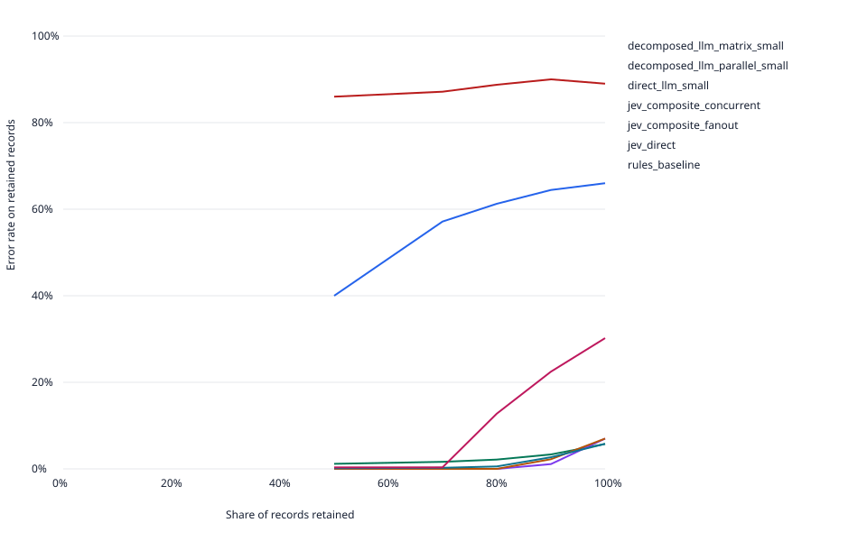
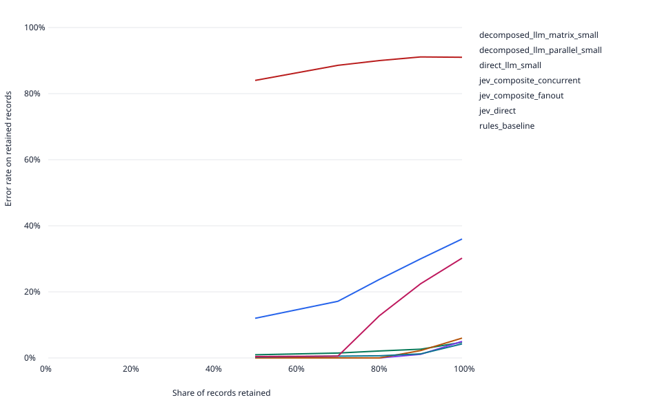

# The sample contains 2,900 records

This test maps company financial-statement labels to 29 standard categories using filed accounting tags as the answer key. It compares Jev and GPT-5 mini on United States Securities and Exchange Commission (SEC) filings, with fixed matching rules as a baseline.

| Property | Tested sample |
| --- | --- |
| Records | 2,900 observed of 2,900 selected; 148,422 eligible in the source corpus |
| Categories | 29; 100 records per category |
| Companies | 2,304 distinct filers |
| Fiscal years | 2021, 2022, 2023, 2024, 2025 |
| Statements | Balance sheet: 1,500; Income statement: 1,400 |
| Label properties | 1,093 have wording mapped differently across filers; 2,558 differ from the standard label |
| Subsets | Composite: 100; repeat: 20; option shuffle: 20 |
| Filing archives | 2021q1–2026q1 |

Sampling balances answer categories; aggregate accuracy does not estimate the natural filing mix.
Source: [validation snapshot](economy-validation.json), including dataset provenance, selected record IDs and raw-evidence hashes.

- Filed tags are a proxy answer key, not independently audited truth.
- The 2026 Q1 cutoff excludes later filings for fiscal year 2025.
- Eligibility requires standard mapped tags and consolidated values denominated in United States dollars.
- Available SEC presentation rows may omit headings.

## Jev misses the study thresholds

Direct with context (2,900 records): Jev 95.8% vs openai/gpt-5-mini 95.2%; 4.3× cheaper at list prices.

Study rule: label only fail (n=100); with context fail (n=100). The shared sample cannot rule out an accuracy loss above 2 percentage points. Review tied composite scoring before choosing a method.

Source: [computed metrics](economy-validation.json).

Run: 20261002T232137Z-571ebdd4. Mode: benchmark. Complete: True.
Known list-price cost: $4.1840; provider requests: 28,568.
Direct methods choose a category. Composite methods combine wording, position and numeric-metadata scores; matrix and bundled variants request all scores together, while separate-question variants use individual calls. Failed calls and abstentions count as wrong; composite and direct sample sizes differ.

| Method | Context | Records | Accuracy | Failures | Cost per 1,000 |
| --- | --- | ---: | ---: | ---: | ---: |
| GPT-5 mini matrix | label_only | 100 | 34.00% | 0.00% | $ 0.7779 |
| GPT-5 mini matrix | with_context | 100 | 64.00% | 0.00% | $ 0.8190 |
| GPT-5 mini separate questions | label_only | 100 | 11.00% | 0.00% | $ 6.2257 |
| GPT-5 mini separate questions | with_context | 100 | 9.00% | 0.00% | $ 6.7496 |
| GPT-5 mini direct | label_only | 2900 | 94.24% | 0.00% | $ 0.2333 |
| GPT-5 mini direct | with_context | 2900 | 95.24% | 0.00% | $ 0.2510 |
| Jev separate questions | label_only | 100 | 93.00% | 0.00% | $ 1.1949 |
| Jev separate questions | with_context | 100 | 95.00% | 0.00% | $ 1.3156 |
| Jev bundled questions | label_only | 100 | 93.00% | 0.00% | $ 0.1427 |
| Jev bundled questions | with_context | 100 | 94.00% | 0.00% | $ 0.1469 |
| Jev direct | label_only | 2900 | 94.21% | 0.00% | $ 0.0539 |
| Jev direct | with_context | 2900 | 95.76% | 0.00% | $ 0.0580 |
| Rules | label_only | 2900 | 69.79% | 0.00% | $ 0.0000 |
| Rules | with_context | 2900 | 69.79% | 0.00% | $ 0.0000 |

## GPT-5 mini dominates spending

| Model | Requests | Input tokens | Output tokens | List-price cost |
| --- | ---: | ---: | ---: | ---: |
| openai/gpt-5-mini | 14,284 | 9,791,643 | 507,534 | $3.4630 |
| typesafe-ai/jev | 14,284 | 17,166,474 | 1,254,165 | $0.7210 |

This run cost $4.1840. All five recorded runs total $5.6677 in known list-price usage. The interrupted prerequisite contains 40 requests with unknown usage; its additional $0.3788 reservation is not a measured charge. See the [cost ledger](economy-validation.json).

## Confidence ranks retained answers

## Limits bound these measurements

- Filed tags are a proxy answer key, not independently audited truth.
- The 2026 Q1 cutoff excludes later filings for fiscal year 2025.
- Eligibility requires standard mapped tags and consolidated values denominated in United States dollars.
- Available SEC presentation rows may omit headings.
- Costs use uncached list prices; billed invoice costs may differ.
- Composite scores are not correctness probabilities.
- Record concurrency: 4; question concurrency: 2. Latency is measured under this load.

The [validation snapshot](economy-validation.json) includes configuration, dataset provenance, source hashes, matched comparisons, calibration, repeatability and option-order results. Raw artifacts are retained locally under results/20261002T232137Z-571ebdd4/.
