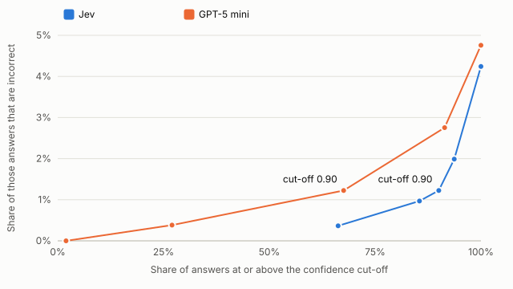
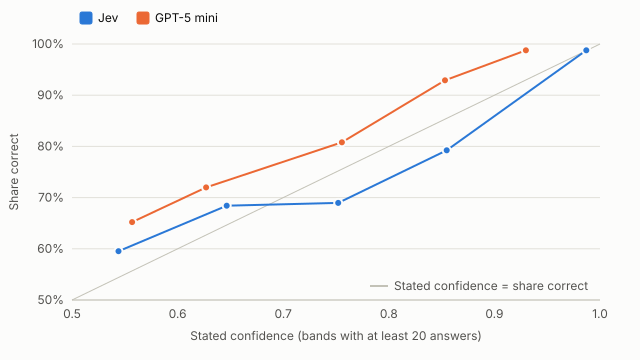

# Statement mapping: detailed report

Run of 2 October 2026. [Summary](summary.md) · [Appendix: methods and data](appendix.md) · [Evidence](evidence.json) · [Methodology](../../docs/methodology.md)

## 1. Question and verdict

A finance data team maps each line of a company's financial statements to a fixed template before any analysis. The study asks how Jev compares with a conventional language model on that decision. Jev is TypeSafe's model that answers a fixed question by choosing from predefined answers and returns a probability for each answer. The conventional model is GPT-5 mini.

Verdict, for choosing one category from a fixed list:

- **Correct answers:** Jev was correct on 2,777 of 2,900 lines and GPT-5 mini on 2,762. The two models gave different results on 101 lines.
- **Cost:** $0.058 per 1,000 records for Jev and $0.251 for GPT-5 mini at list prices, 77% lower for Jev. Both amounts are small.
- **Speed:** a median response of 0.63 seconds for Jev and 1.30 seconds for GPT-5 mini.
- **Confidence:** Jev's confidence scores were closer to how often it was correct, with an average gap of 0.6 percentage points against 6.3 for GPT-5 mini. A cut-off on Jev's scores can be read more directly.
- **Incorrect answers:** both models had trouble with the same few "other" and "total" categories, mostly on lines where the company's tag differs from what other companies use for the same wording.

## 2. What was tested

**The decision.** Each record is one line from an income statement or balance sheet. The model chooses its category from the template's 29 categories, 14 for the income statement and 15 for the balance sheet; each line is offered only the categories of its own statement. For example, "Other income, net" can be the non-operating total or one component of it, and the neighbouring lines usually show which.

**The data.** Lines come from the SEC Financial Statement Data Sets: US company annual reports (10-K) for fiscal years 2021 to 2025.

<!-- begin sample -->
| Property | Value |
| --- | --- |
| Records | 2,900 |
| Categories | 29; 100 records each |
| Companies | 2,304 |
| Fiscal years | 2021, 2022, 2023, 2024, 2025 |
| Statements | 1,500 balance sheet lines; 1,400 income statement lines |
| Consistency checks | 20 records asked twice; 20 with reordered options |
<!-- end -->

**The scope.** A line is in scope when the company tagged it with one of the template's standard tags. Lines without such a tag, for example "General and administrative" or "Total operating expenses", are not tested. Results apply to the in-scope lines only. The [case spec](../../docs/cases/statement-mapping.md) shows what is left out, with a full income statement as an example.

<!-- begin scope -->
| Step | Lines | Share of all lines |
| --- | --- | --- |
| Income-statement and balance-sheet lines in the selected filings | 1,694,559 | 100.0% |
| In scope: tag on the template list, standard taxonomy, one consolidated USD value | 412,512 | 24.3% |
| After removing repeats of the same wording by the same company | 148,422 | 8.8% |
| Sampled | 2,900 | 0.2% |
<!-- end -->

**The answer key.** Each line's category comes from the tag the company filed, which models do not see. An answer is correct when it matches that category. The tag records the company's own judgement and is not independently reviewed.

**The methods.**

- **Jev:** one call per line, asking which category the line belongs to, with the category descriptions as the answer options.
- **GPT-5 mini:** one call per line, at its lowest reasoning setting, returning a category and a confidence between 0 and 1.
- **Keyword rules:** fixed patterns on the wording that answer only when a rule matches.

Each model ran twice on every line: once with the wording only, and once with context (the two lines above and below, the amount's sign, its size relative to revenue or total assets, and the company's industry). Results use the version with context unless stated.

**Sample design.** This run took 100 lines from each category. Rare categories, which are often the harder ones, therefore weigh more than they do in filings. The next run samples at random.

## 3. Correct answers

<!-- begin results -->
| Model | Correct | Cost per 1,000 records | Median response |
| --- | --- | --- | --- |
| Jev | 2,777 of 2,900 (95.8%) | $0.058 | 0.63s |
| GPT-5 mini | 2,762 of 2,900 (95.2%) | $0.251 | 1.30s |
<!-- end -->

On 2,799 of the 2,900 lines both models had the same outcome. The difference of 15 correct answers comes from the 101 lines where they differed. The study makes no claim beyond these records.

<!-- begin pairs -->
| Comparison | Both correct | Both incorrect | Only Jev correct | Only the other model correct |
| --- | --- | --- | --- | --- |
| Jev and GPT-5 mini | 2,719 | 80 | 58 | 43 |
<!-- end -->

Context helped both models: Jev answered 45 more lines correctly with context, and GPT-5 mini 29 more.

<!-- begin context -->
| Model | Wording only | Wording with context |
| --- | --- | --- |
| Jev | 2,732 of 2,900 | 2,777 of 2,900 |
| GPT-5 mini | 2,733 of 2,900 | 2,762 of 2,900 |
<!-- end -->

Keyword rules answered 70% of lines, almost all correctly, and left the rest unanswered.

<!-- begin rules -->
| Records | Answered by rules | Correct among answered | Left unanswered |
| --- | --- | --- | --- |
| 2,900 | 2,035 | 2,024 of 2,035 | 865 |
<!-- end -->

## 4. Confidence

Every answer comes with a confidence score. Jev returns a probability for each category; GPT-5 mini states a confidence because the prompt asks for one. A score is only useful for setting a cut-off if it matches how often answers are correct.

These records show the pattern. They were chosen by hand and do not show how often each case occurs.

<!-- begin records ac73de54840e 0c9ccb042e54 345ea022f832 c9e3087c1ea7 03517731f696 -->
| Company: line in context | Answer key | Jev | GPT-5 mini |
| --- | --- | --- | --- |
| BOXABL INC. 2025: Accumulated deficit → **Total stockholders equity** → Total liabilities and stockholders equity | Total equity | ✓ Total equity (1.00) | ✓ Total equity (0.90) |
| 23ANDME HOLDING CO. 2024: Interest income, net → **Other income (expense), net** → Loss before reorganization items and income taxes | Total non-operating income or expense | ✓ Total non-operating income or expense (0.65) | ✗ Other non-operating income or expense (0.90) |
| FUTUREFUEL CORP. 2025: Gain on marketable securities → **Other income, net** → Other income | Other non-operating income or expense | ✗ Total non-operating income or expense (0.63) | ✓ Other non-operating income or expense (0.85) |
| HST GLOBAL, INC. 2023: Revenues → **Consulting, related party** → General and administrative | Other operating items | ✗ Revenue (0.29) | ✗ Revenue (0.70) |
| BIOMARIN PHARMACEUTICAL INC 2025: Interest expense → **Other income (expense), net** → INCOME BEFORE INCOME TAXES | Other operating items | ✗ Total non-operating income or expense (0.97) | ✗ Other non-operating income or expense (0.90) |
<!-- end -->

The table counts the answers at or above each cut-off and how many of them are incorrect. At 0.90, both models' answers are 1.2% incorrect; Jev keeps 2,611 answers and GPT-5 mini 1,959. How many incorrect answers are acceptable is a business decision, not a result of this study.

<!-- begin cutoffs -->
| Confidence at or above | Jev: answers | Jev: incorrect | GPT-5 mini: answers | GPT-5 mini: incorrect |
| --- | --- | --- | --- | --- |
| 0.99 | 1,921 | 7 (0.4%) | 57 | 0 (0.0%) |
| 0.95 | 2,479 | 24 (1.0%) | 783 | 3 (0.4%) |
| 0.90 | 2,611 | 32 (1.2%) | 1,959 | 24 (1.2%) |
| 0.80 | 2,717 | 54 (2.0%) | 2,651 | 73 (2.8%) |
| Any (all answers) | 2,900 | 123 (4.2%) | 2,900 | 138 (4.8%) |
<!-- end -->

<!-- begin chart-cutoffs -->

<!-- end -->

Each point is one cut-off: 0.99, 0.95, 0.90, 0.80, and all answers on the right.

The second chart compares stated confidence with the share of answers that were correct, in bands of 0.1. GPT-5 mini states a lower confidence than its share correct in every band with at least 20 answers: answers it rated around 0.93 were correct 98.8% of the time. Jev's top band, 2,611 answers rated 0.9 or higher, averaged 0.99 and was correct 98.8% of the time. Below 0.9, with 42 to 106 answers per band, Jev's share correct was within about 6 points of its stated confidence, sometimes above and sometimes below. Weighted by the number of answers, the average gap is 0.6 percentage points for Jev and 6.3 for GPT-5 mini. A cut-off for GPT-5 mini therefore has to be set by measuring its answers first.

<!-- begin chart-calibration -->

<!-- end -->

Each point is a band of stated confidence with at least 20 answers. Points above the grey line mean the model was correct more often than it stated.

**Confidence-gated routing.** TypeSafe documents a pattern that acts on an answer only above a confidence cut-off and sends the rest elsewhere. Sending Jev's answers below a cut-off to GPT-5 mini instead would not change how many are correct:

<!-- begin routing -->
| Jev confidence below | Records | Jev correct | Other model | Other model correct |
| --- | --- | --- | --- | --- |
| 0.95 | 421 | 322 | GPT-5 mini | 322 |
| 0.90 | 289 | 198 | GPT-5 mini | 200 |
| 0.80 | 183 | 114 | GPT-5 mini | 114 |
<!-- end -->

## 5. Where incorrect answers come from

Four categories account for 89 of Jev's 123 incorrect answers and 97 of GPT-5 mini's 138. The two models err in opposite directions on non-operating items: Jev more often calls a component the total, and GPT-5 mini more often calls the total a component.

<!-- begin errors with_context 6 -->
| Category | Records | Jev incorrect | GPT-5 mini incorrect |
| --- | --- | --- | --- |
| Other operating items | 100 | 48 | 42 |
| Other non-operating income or expense | 100 | 26 | 12 |
| Total non-operating income or expense | 100 | 7 | 31 |
| Other current liabilities | 100 | 8 | 12 |
| Interest expense | 100 | 2 | 10 |
| Interest income | 100 | 6 | 4 |
| Other 23 categories | 2,300 | 26 | 27 |
| All categories | 2,900 | 123 | 138 |
<!-- end -->

**How consistent the answer key is.** Companies are consistent with themselves: the same company maps the same wording to the same category in different filings almost every time. Different companies using the same wording agree less often. Part of that difference is legitimate, because the same words can mean different things on different statements.

<!-- begin agreement -->
| Comparison | Cases | Same category |
| --- | --- | --- |
| Same company, same wording, different filings | 96,533 | 99.7% |
| Two different companies, same wording | 2,559 sampled records | 95.5% |
<!-- end -->

**Usual and unusual tags.** For each line, the other companies using the same wording show the usual category for it. Both models are almost always correct when the company followed the usual choice, and mostly incorrect when it did not. Those 89 lines hold nearly half of each model's incorrect answers.

<!-- begin wording -->
| The company's tag for its wording is | Records | Jev correct | GPT-5 mini correct |
| --- | --- | --- | --- |
| The usual choice of other companies using the wording | 2,470 | 2,432 (98.5%) | 2,421 (98.0%) |
| Different from the usual choice | 89 | 31 (34.8%) | 26 (29.2%) |
| Wording no other company uses | 341 | 314 (92.1%) | 315 (92.4%) |
<!-- end -->

About 1,400 companies use the wording "Other income (expense), net" on their income statement. The 28 sample lines with that wording show how the two models differ. GPT-5 mini gave the usual answer every time. Jev used the surrounding lines more: it found most of the totals, but also called 9 of the usual cases totals.

<!-- begin worked IS other income expense net -->
| Filed as | Companies using this wording | Records in sample | Jev correct | GPT-5 mini correct |
| --- | --- | --- | --- | --- |
| Other non-operating income or expense | 1,152 (82%) | 15 | 6 | 15 |
| Total non-operating income or expense | 183 (13%) | 6 | 5 | 0 |
| Other operating items | 68 (5%) | 7 | 0 | 0 |
<!-- end -->

On unusual lines there are two kinds of miss, and the data cannot separate them automatically. Sometimes the neighbouring lines give the company's choice away and the model missed it: Green Giant's "Other assets" sits between inventory and prepayments, which marks it as current. Sometimes nothing in the input shows the choice: Joby files "Cost of Revenue" as other operating items, while every other company using that wording files it as cost of revenue.

<!-- begin records b32fa21cc869 56f6e4658a67 b16c03b1d4d7 3000a6d98dea -->
| Company: line in context | Answer key | Jev | GPT-5 mini |
| --- | --- | --- | --- |
| EMPIRE PETROLEUM CORP 2024: Operating Loss → **Interest Expense** → Other Income (Expense) | Total non-operating income or expense | ✗ Interest expense (0.99) | ✗ Interest expense (0.98) |
| JOBY AVIATION, INC. 2025: Operating expenses: → **Cost of Revenue** → Research and development | Other operating items | ✗ Cost of revenue (0.98) | ✗ Cost of revenue (0.95) |
| ROPER TECHNOLOGIES INC 2025: Equity investments gain, net → **Other (income) expense, net** → Earnings before income taxes | Total non-operating income or expense | ✗ Other non-operating income or expense (0.63) | ✗ Other non-operating income or expense (0.85) |
| GREEN GIANT INC. 2023: Inventory → **Other assets** → Prepayment | Other current assets | ✗ Other non-current assets (0.64) | ✗ Other non-current assets (0.79) |
<!-- end -->

## 6. Cost and speed

Cost is measured per call from the tokens used, at the list prices of the Vercel AI Gateway on 2 October 2026. Jev reads about twice as many input tokens as GPT-5 mini, but at a sixth of the price, and its output is not charged. Costs are not invoices and exclude integration work.

<!-- begin tokens -->
| Model | Input tokens per call | Output tokens per call | Price per million input tokens | Price per million output tokens | Cost per 1,000 records |
| --- | --- | --- | --- | --- | --- |
| Jev | 1,382 | 158 | $0.042 | $0 | $0.058 |
| GPT-5 mini | 722 | 35 | $0.25 | $2 | $0.251 |
<!-- end -->

Response times were measured with four records in progress at a time.

<!-- begin speed -->
| Model | Median response | 95th percentile |
| --- | --- | --- |
| Jev | 0.63s | 0.91s |
| GPT-5 mini | 1.30s | 1.77s |
<!-- end -->

## 7. Consistency

Each model was asked 20 lines a second time, and 20 lines with the answer options in a different order. With context, no answer changed. With 20 lines, one changed answer moves the result by 5 points, so this check can only detect large instability. The next run uses about 290 lines for each check.

<!-- begin consistency -->
| Check | Model | Changed, wording only | Changed, with context |
| --- | --- | --- | --- |
| Asked twice | Jev | 1 of 20 | 0 of 20 |
| Asked twice | GPT-5 mini | 1 of 20 | 0 of 20 |
| Options reordered | Jev | 2 of 20 | 0 of 20 |
| Options reordered | GPT-5 mini | 1 of 20 | 0 of 20 |
<!-- end -->

## 8. Development effort

Both methods needed about the same amount of code in this study: one call per line, about 15 lines each, sharing the same runner, retries and cost tracking.

- **Jev:** one question with the category descriptions as answer options. The response includes a probability for every option. Jev rounds its probabilities, so their sum can be 0.99 or 1.01; the check on the response allows for that rounding.
- **GPT-5 mini:** a system prompt and a response format that restricts the answer to the offered categories plus a confidence. The number of parallel requests and GPT-5 mini's output-token limit had to be lowered after connection errors on GPT-5 mini calls.

How to compare the effort of building and maintaining each workflow more fully is an open question in the [backlog](../../docs/backlog.md).

## 9. Limits

- **Scope:** only lines with one of the template's standard tags, about a quarter of all statement lines.
- **Answer key:** the company's own tag, not an independent review.
- **Models:** one conventional model at its lowest reasoning setting.
- **Sample:** 100 lines per category, not the mix found in filings.
- **Consistency checks:** 20 lines each.
- **Prices:** list prices on one gateway on one date.
- **Data:** public annual reports of US companies, not private management accounts.

## 10. Next steps

- **Next run:** random sampling, a "not mapped" answer for totals and per-share lines, a fix to duplicate removal, consistency checks on about 290 lines, and a test of asking several questions about one line in one call. Which comparison models to include is still open.
- **Before any use:** repeat the comparison on the team's own data, with its own analysts reviewing the answer key.
- **Open questions:** listed in the [backlog](../../docs/backlog.md).
