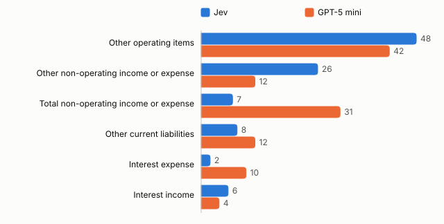

# Statement mapping: summary

Run of 2 October 2026. [Detailed report](report.md) · [Appendix: methods and data](appendix.md) · [Evidence](evidence.json)

## Question and verdict

A finance data team maps each line of a company's financial statements to a fixed template. How does Jev, TypeSafe's model that answers a fixed question by choosing from predefined answers, compare with a conventional language model, GPT-5 mini, on that decision?

On 2,900 lines from US company annual reports, Jev was correct on 2,777 and GPT-5 mini on 2,762. The two models gave different results on 101 lines. Jev cost about a quarter as much per record at list prices and answered in half the time. Its confidence scores were closer to how often it was actually correct, which makes a confidence cut-off easier to set. Both models had trouble with the same few "other" and "total" categories, mostly on lines where the company's tag differs from what most companies use for the same wording.

The verdict covers this kind of decision only: choosing one category from a fixed list.

## Main results

Each model saw the line's wording, its neighbouring lines, the amount's sign and size, and the company's industry.

<!-- begin results -->
| Model | Correct | Cost per 1,000 records | Median response |
| --- | --- | --- | --- |
| Jev | 2,777 of 2,900 (95.8%) | $0.058 | 0.63s |
| GPT-5 mini | 2,762 of 2,900 (95.2%) | $0.251 | 1.30s |
<!-- end -->

Keyword rules, without a model, answered 2,035 of the 2,900 lines, 2,024 of them correctly, and left 865 unanswered.

## Confidence

Every answer comes with a confidence score. A score is only useful for setting a cut-off if it matches how often answers are correct. At a cut-off of 0.90, the answers at or above it are 1.2% incorrect for both models; Jev's cut-off keeps 2,611 answers and GPT-5 mini's keeps 1,959.

<!-- begin chart-cutoffs -->

<!-- end -->

Each point is one cut-off: 0.99, 0.95, 0.90, 0.80, and all answers on the right.

## Where incorrect answers come from

Four categories account for 89 of Jev's 123 incorrect answers and 97 of GPT-5 mini's 138. Nearly half of each model's incorrect answers (Jev 58, GPT-5 mini 63) are on 89 lines where the company's tag differs from the one most other companies use for the same wording.

<!-- begin chart-errors with_context 6 -->

<!-- end -->

The six categories with the most incorrect answers; each category has 100 lines in this run.

## Limits and next steps

- The test covers lines whose filed tag maps to one of the 29 categories, about a quarter of all statement lines.
- The answer key is each company's own tag; it is not independently reviewed.
- GPT-5 mini ran at its lowest reasoning setting; other models and settings were not tested.
- This run took 100 lines from each category, so rare, harder categories weigh more than they do in filings.
- The next run samples at random, adds a "not mapped" answer and larger consistency checks, and tests asking several questions in one call. Before any use, the comparison should be repeated on the team's own data with its own analysts.
