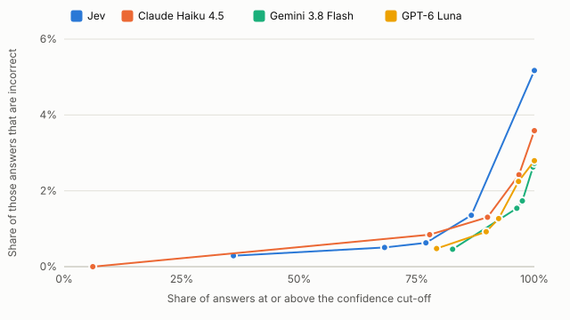
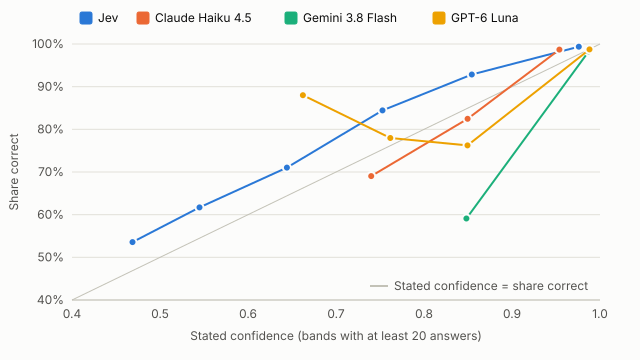

# Statement mapping: detailed report

Runs of 4 October 2026. [Summary](summary.md) · [Appendix](appendix.md) · [Evidence](evidence.json) · [Methodology](../../docs/methodology.md)

## Purpose

Find out whether Jev is a better building block than conventional language models for repeated finance data decisions. [Jev](https://docs.typesafe.ai/concepts/system-one) is TypeSafe's model that answers a fixed question by choosing from predefined answers, with a probability for each. The test decision is mapping financial statement lines to a standard template.

## What we tested

2,900 lines from US annual reports, each to be mapped to one of 29 template categories or "not mapped". Jev against three low-cost chat models: GPT-6 Luna, Gemini 3.8 Flash and Claude Haiku 4.5. Keyword rules serve as a reference. Measured, as defined in the [methodology](../../docs/methodology.md#metrics): correct answers, confidence, cost, speed and consistency.

## Outcome

Gemini 3.8 Flash and GPT-6 Luna were correct on 2,821 and 2,819 of 2,900 lines; Jev on 2,750. GPT-6 Luna cost $0.090 per 1,000 lines against Jev's $0.063, and its stated confidence matched its share correct most closely. Jev was the fastest, at 0.56 seconds per line, and its 2,231 answers at confidence 0.90 or above were 0.6% incorrect. For this task GPT-6 Luna is the stronger building block; Jev's advantages are speed and the lowest cost.

## 1. Method

**Decision.** One line in, one answer out: one of the 14 income-statement or 15 balance-sheet categories of the line's statement, or "not mapped" for totals and subtotals the template does not hold.

**Data and answer key.** SEC [Financial Statement Data Sets](https://www.sec.gov/data-research/sec-markets-data/financial-statement-data-sets): annual reports (10-K) for fiscal years 2021 to 2025. The answer key is the category of the tag the company filed; models do not see it. An answer is correct when it matches. The tag is the company's own judgement, not an independent review.

**Scope and sample.** Lines with a standard tag on the template list or the not-mapped list ([case spec](../../docs/cases/statement-mapping.md)). The 2,900 lines are drawn at random, so categories appear as often as in the data.

<!-- begin scope -->
| Step | Lines | Share of all lines |
| --- | --- | --- |
| Income-statement and balance-sheet lines in the selected filings | 1,694,559 | 100.0% |
| In scope: a standard tag on the case's lists and one consolidated USD value | 597,580 | 35.3% |
| After removing repeats of the same wording by the same company | 210,738 | 12.4% |
| Sampled | 2,900 | 0.2% |
<!-- end -->

<!-- begin sample -->
| Property | Value |
| --- | --- |
| Records | 2,900 |
| Categories | 30; 14–819 records each |
| Companies | 2,386 |
| Fiscal years | 2021, 2022, 2023, 2024, 2025 |
| Statements | 1,655 balance sheet lines; 1,245 income statement lines |
| Consistency checks | 290 records asked twice; 290 with reordered options |
<!-- end -->

**Models.** All are called through the [Vercel AI Gateway](https://vercel.com/docs/ai-gateway) with the same input and answer options. Chat models run at their lowest reasoning setting, the usual choice for high-volume tasks.

| Model | Type | Reasoning | Input versions asked |
| --- | --- | --- | --- |
| [Jev](https://vercel.com/ai-gateway/models/jev) | Decision model | None | Wording only; with context |
| [GPT-6 Luna](https://vercel.com/ai-gateway/models/gpt-6-luna) | Chat model | None | Wording only; with context |
| [Gemini 3.8 Flash](https://vercel.com/ai-gateway/models/gemini-3.8-flash) | Chat model | Low | Wording only; with context |
| [Claude Haiku 4.5](https://vercel.com/ai-gateway/models/claude-haiku-4.5) | Chat model | Off | With context |
| Keyword rules | Fixed patterns ([rules](../../cases/sec_lines/rules.yaml)) | None | Wording only; with context |

**Input.** With context: the line's wording, the two lines above and below, the amount's sign and size relative to revenue or total assets, and the company's industry. Wording only: the line's wording and statement.

**Measures.** Correct answers; lines where two models differ; answers and errors above confidence cut-offs, and calibration; cost per 1,000 lines at list prices; median response time; answers that change when a line is asked twice or with reordered options. No claims beyond the tested lines.

## 2. Results

Results use the input with context.

### Correct answers

Gemini 3.8 Flash and GPT-6 Luna lead; Jev is correct on 2,750 lines. Context helped GPT-6 Luna (30 more correct) but not Jev or Gemini 3.8 Flash. Keyword rules answer 1,608 lines, 93% of them correctly.

<!-- begin results -->
| Model | Correct | Cost per 1,000 records | Median response |
| --- | --- | --- | --- |
| Jev | 2,750 of 2,900 (94.8%) | $0.063 | 0.56s |
| Claude Haiku 4.5 | 2,796 of 2,900 (96.4%) | $1.184 | 1.09s |
| Gemini 3.8 Flash | 2,821 of 2,900 (97.3%) | $0.735 | 1.90s |
| GPT-6 Luna | 2,819 of 2,900 (97.2%) | $0.090 | 1.45s |
<!-- end -->

<!-- begin pairs -->
| Comparison | Both correct | Both incorrect | Only Jev correct | Only the other model correct |
| --- | --- | --- | --- | --- |
| Jev and Claude Haiku 4.5 | 2,702 | 56 | 48 | 94 |
| Jev and Gemini 3.8 Flash | 2,734 | 63 | 16 | 87 |
| Jev and GPT-6 Luna | 2,725 | 56 | 25 | 94 |
<!-- end -->

<!-- begin context -->
| Model | Wording only | Wording with context |
| --- | --- | --- |
| Jev | 2,753 of 2,900 | 2,750 of 2,900 |
| Claude Haiku 4.5 | – | 2,796 of 2,900 |
| Gemini 3.8 Flash | 2,825 of 2,900 | 2,821 of 2,900 |
| GPT-6 Luna | 2,789 of 2,900 | 2,819 of 2,900 |
<!-- end -->

<!-- begin rules -->
| Records | Answered by rules | Correct among answered | Left unanswered |
| --- | --- | --- | --- |
| 2,900 | 1,608 | 1,495 of 1,608 | 1,292 |
<!-- end -->

### Confidence

The cut-off table counts the answers at or above each confidence level and how many of those are incorrect. How many errors are acceptable is a business decision.

<!-- begin cutoffs -->
| Model | Confidence ≥ 0.99 | Confidence ≥ 0.95 | Confidence ≥ 0.90 | Confidence ≥ 0.80 | All answers |
| --- | --- | --- | --- | --- | --- |
| Jev | 1,044 (3 incorrect, 0.3%) | 1,976 (10 incorrect, 0.5%) | 2,231 (14 incorrect, 0.6%) | 2,511 (34 incorrect, 1.4%) | 2,900 (150 incorrect, 5.2%) |
| Claude Haiku 4.5 | 177 (0 incorrect, 0.0%) | 2,254 (19 incorrect, 0.8%) | 2,611 (34 incorrect, 1.3%) | 2,805 (68 incorrect, 2.4%) | 2,900 (104 incorrect, 3.6%) |
| Gemini 3.8 Flash | 2,396 (11 incorrect, 0.5%) | 2,792 (43 incorrect, 1.5%) | 2,826 (49 incorrect, 1.7%) | 2,892 (76 incorrect, 2.6%) | 2,900 (79 incorrect, 2.7%) |
| GPT-6 Luna | 2,297 (11 incorrect, 0.5%) | 2,603 (24 incorrect, 0.9%) | 2,680 (34 incorrect, 1.3%) | 2,802 (63 incorrect, 2.2%) | 2,900 (81 incorrect, 2.8%) |
<!-- end -->

<!-- begin chart-cutoffs -->

<!-- end -->

Each point is one cut-off: 0.99, 0.95, 0.90, 0.80, and all answers on the right. The calibration chart compares stated confidence with the share correct; points above the grey line mean a model was correct more often than it stated. Jev understates: its answers rated around 0.75 were correct 84% of the time. Gemini 3.8 Flash overstates in its few lower-rated answers: those rated around 0.85 were correct 59% of the time.

<!-- begin chart-calibration -->

<!-- end -->

Sending Jev's answers below a cut-off to a chat model instead:

<!-- begin routing -->
| Jev confidence below | Records | Jev correct | Other model | Other model correct |
| --- | --- | --- | --- | --- |
| 0.95 | 924 | 784 | Claude Haiku 4.5 | 835 |
| 0.90 | 669 | 533 | Claude Haiku 4.5 | 583 |
| 0.80 | 389 | 273 | Claude Haiku 4.5 | 319 |
| 0.95 | 924 | 784 | Gemini 3.8 Flash | 854 |
| 0.90 | 669 | 533 | Gemini 3.8 Flash | 601 |
| 0.80 | 389 | 273 | Gemini 3.8 Flash | 334 |
| 0.95 | 924 | 784 | GPT-6 Luna | 854 |
| 0.90 | 669 | 533 | GPT-6 Luna | 601 |
| 0.80 | 389 | 273 | GPT-6 Luna | 333 |
<!-- end -->

### Where incorrect answers come from

Errors concentrate in a few categories that need judgement: totals against their components, and net income or total equity against "not mapped". Each model errs in different places. Lines where the company's tag differs from what most other companies use for the same wording are hardest for every model.

<!-- begin errors with_context 6 -->
| Category | Records | Jev incorrect | Claude Haiku 4.5 incorrect | Gemini 3.8 Flash incorrect | GPT-6 Luna incorrect |
| --- | --- | --- | --- | --- | --- |
| Not mapped | 819 | 28 | 29 | 9 | 17 |
| Other non-operating income or expense | 82 | 35 | 7 | 22 | 13 |
| Total equity | 183 | 18 | 4 | 25 | 0 |
| Total non-operating income or expense | 64 | 5 | 28 | 1 | 12 |
| Net income | 185 | 24 | 3 | 0 | 7 |
| Other operating items | 14 | 5 | 4 | 5 | 4 |
| Other 24 categories | 1,553 | 35 | 29 | 17 | 28 |
| All categories | 2,900 | 150 | 104 | 79 | 81 |
<!-- end -->

<!-- begin wording -->
| The company's tag for its wording is | Records | Jev correct | Claude Haiku 4.5 correct | Gemini 3.8 Flash correct | GPT-6 Luna correct |
| --- | --- | --- | --- | --- | --- |
| The usual choice of other companies using the wording | 2,583 | 2,510 (97.2%) | 2,526 (97.8%) | 2,560 (99.1%) | 2,552 (98.8%) |
| Different from the usual choice | 55 | 11 (20.0%) | 22 (40.0%) | 24 (43.6%) | 19 (34.5%) |
| Wording no other company uses | 262 | 229 (87.4%) | 248 (94.7%) | 237 (90.5%) | 248 (94.7%) |
<!-- end -->

### Examples

Real lines, chosen by hand to show each kind of outcome; they do not show how often each occurs. Company names link to the annual report on SEC EDGAR.

<!-- begin records 288987609f3e 47cb950009bb 071c6ebcda5f 229cbf50c961 2a5235e7a21d -->
| Company: line in context | Answer key | Jev | Claude Haiku 4.5 | Gemini 3.8 Flash | GPT-6 Luna |
| --- | --- | --- | --- | --- | --- |
| [BTCS INC. 2025](https://www.sec.gov/Archives/edgar/data/1436229/000149315226012916/0001493152-26-012916-index.htm): Total other assets → **Total Assets** → Accounts payable and accrued expenses | Not mapped | ✓ Not mapped (0.99) | ✓ Not mapped (0.98) | ✓ Not mapped (1.00) | ✓ Not mapped (1.00) |
| [REATA PHARMACEUTICALS INC 2022](https://www.sec.gov/Archives/edgar/data/1358762/000095017023004236/0000950170-23-004236-index.htm): Total expenses → **Other income (expense), net** → Loss before taxes on income | Total non-operating income or expense | ✓ Total non-operating income or expense (0.95) | ✗ Other non-operating income or expense (0.85) | ✓ Total non-operating income or expense (0.85) | ✗ Other non-operating income or expense (0.86) |
| [ONEWATER MARINE INC. 2021](https://www.sec.gov/Archives/edgar/data/1772921/000114036121042274/0001140361-21-042274-index.htm): Less: Net income attributable to non-controlling interest → **Net (loss) income attributable to One Water Marine Holdings, LLC** → Earnings per share, Basic (in dollars per share) | Net income | ✗ Not mapped (0.70) | ✓ Net income (0.95) | ✓ Net income (0.95) | ✓ Net income (0.96) |
| [VERVE THERAPEUTICS, INC. 2024](https://www.sec.gov/Archives/edgar/data/1840574/000095017025028376/0000950170-25-028376-index.htm): Unrealized gain (loss) on marketable securities → **Comprehensive loss** | Not mapped | ✗ Net income (0.80) | ✓ Not mapped (0.95) | ✓ Not mapped (0.99) | ✓ Not mapped (0.96) |
| [LOCKHEED MARTIN CORP 2025](https://www.sec.gov/Archives/edgar/data/936468/000162828026004195/0001628280-26-004195-index.htm): Other unallocated, net → **Total operating costs and expenses** → Gross profit | Cost of revenue | ✗ Not mapped (0.88) | ✗ Not mapped (0.95) | ✗ Not mapped (0.99) | ✗ Not mapped (0.96) |
<!-- end -->

The second line is the only line between operating and pre-tax results, so it is the non-operating total; Jev used that position. In the last line, every model called a total "not mapped" where the company filed it as cost of revenue.

### Cost and speed

Jev reads more input tokens per call, at a fraction of the price, and its output is not charged.

<!-- begin tokens -->
| Model | Input tokens per call | Output tokens per call | Price per million input tokens | Price per million output tokens | Cost per 1,000 records |
| --- | --- | --- | --- | --- | --- |
| Jev | 1,497 | 167 | $0.042 | $0 | $0.063 |
| Claude Haiku 4.5 | 1,087 | 19 | $1 | $5 | $1.184 |
| Gemini 3.8 Flash | 855 | 25 | $0.75 | $3.75 | $0.735 |
| GPT-6 Luna | 794 | 21 | $0.1 | $0.5 | $0.090 |
<!-- end -->

<!-- begin speed -->
| Model | Median response | 95th percentile |
| --- | --- | --- |
| Jev | 0.56s | 0.86s |
| Claude Haiku 4.5 | 1.09s | 1.55s |
| Gemini 3.8 Flash | 1.90s | 3.72s |
| GPT-6 Luna | 1.45s | 2.23s |
<!-- end -->

### Consistency

Answers that changed when a line was asked a second time, or with its answer options in a different order:

<!-- begin consistency -->
| Check | Model | Changed, wording only | Changed, with context |
| --- | --- | --- | --- |
| Asked twice | Jev | 2 of 290 | 4 of 290 |
| Asked twice | Claude Haiku 4.5 | – | 6 of 290 |
| Asked twice | Gemini 3.8 Flash | 0 of 290 | 0 of 290 |
| Asked twice | GPT-6 Luna | 0 of 290 | 1 of 290 |
| Options reordered | Jev | 5 of 290 | 3 of 290 |
| Options reordered | Claude Haiku 4.5 | – | 7 of 290 |
| Options reordered | Gemini 3.8 Flash | 0 of 290 | 3 of 290 |
| Options reordered | GPT-6 Luna | 9 of 290 | 6 of 290 |
<!-- end -->

## 3. What it means for statement mapping

- **Correct answers.** GPT-6 Luna and Gemini 3.8 Flash answer 69 and 71 more of the 2,900 lines correctly than Jev. On the 2,583 lines where the company used the usual tag for its wording, all models are 97–99% correct; the gap comes from judgement-heavy lines.
- **Cost.** GPT-6 Luna costs $0.027 more per 1,000 lines than Jev. Gemini 3.8 Flash and Claude Haiku 4.5 cost 12 and 19 times as much as Jev.
- **Speed.** Jev answers 2.6 times faster than GPT-6 Luna, which matters where a mapping is needed while a user waits.
- **Confidence.** Above a 0.90 cut-off, Jev keeps fewer answers than GPT-6 Luna (2,231 against 2,680) with fewer errors among them (0.6% against 1.3%).
- **Combining.** Sending Jev's 669 answers below 0.90 to GPT-6 Luna gives 2,818 correct at $0.084 per 1,000 lines: GPT-6 Luna's result, not better.
- **Answer description.** 42 of Jev's 150 incorrect answers are net income and total equity lines it called "not mapped", 35 of them involving noncontrolling interests or "attributable to" wording. A narrower "not mapped" description may change this.
- **Limits.** One task on public US annual reports; the company's filed tag is the answer key; chat models at their lowest reasoning setting; list prices on 4 October 2026.

## 4. Development

TypeSafe's [approach](https://docs.typesafe.ai/concepts/how-to-build-with-system-one) keeps control flow in code, asks the model narrow questions and sends uncertain answers to a person or a stronger model ([confidence-gated routing](https://docs.typesafe.ai/patterns/confidence-routing)). For statement mapping:

- **Building.** Each model needed about 15 lines of code. Jev takes the categories as typed answer options and returns probabilities. Chat models need an instruction, a strict JSON answer format and provider-specific settings: GPT-6 Luna takes a reasoning effort level, Claude Haiku 4.5 an on/off switch.
- **Running.** All models run through one gateway. Jev is cheapest and fastest. Availability varies by provider: Qwen 3.8 Flash returned "service unavailable" on 80 of 138 trial requests and was left out. Other decision models change where the model runs, which matters for financial data: Databricks [`ai_decide`](https://docs.databricks.com/aws/en/sql/language-manual/functions/ai_decide) runs inside Databricks over governed data, and Cloudflare's [CLEF](https://huggingface.co/Cloudflare/clef) has open weights that can be hosted in-house. Neither was tested.
- **Testing.** One [dataset](../../data/samples/sec_lines-2900-8bad7b33/dataset.json) and one harness test every model. No model was fully repeatable: asked a second time, Jev changed 4 of 290 answers, GPT-6 Luna 1, Gemini 3.8 Flash 0.
- **Monitoring.** Jev returns a probability for every option without being asked; its confidence errs on the cautious side (correct more often than stated). GPT-6 Luna's and Gemini 3.8 Flash's stated confidence matched their share correct more closely on average (gap 0.8 and 1.1 points; Jev 3.2).
- **Routing.** The recommended pattern, Jev first and uncertain answers to a chat model, reached GPT-6 Luna's accuracy but not more.

## 5. Backlog

Open items, in full in the [backlog](../../docs/backlog.md):

- Other decision models: Cloudflare [CLEF](https://huggingface.co/Cloudflare/clef), OpenAI's [Decisions API](https://www.firecrawl.dev/blog/openai-decisions-api-vs-jev), Databricks [`ai_decide`](https://docs.databricks.com/aws/en/sql/language-manual/functions/ai_decide), and [Laya](https://vercel.com/ai-gateway/models/laya) and [Liquid d1](https://vercel.com/ai-gateway/models/d1) on the same gateway.
- A narrower "not mapped" description.
- Chat models at higher reasoning settings, and larger models.
- Two questions in one call ([speculative fan-out](https://docs.typesafe.ai/patterns/fan-out)), as a separate run on this dataset.
- A second sample, to check whether the differences hold.
- A second case that ranks candidates ([composite scoring](https://docs.typesafe.ai/patterns/composite-scoring)).
