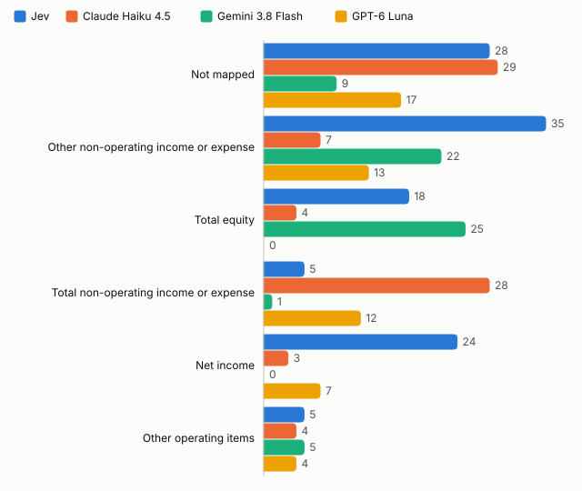

# Statement mapping: summary

Runs of 4 October 2026. [Detailed report](report.md) · [Appendix](appendix.md) · [Evidence](evidence.json)

## Purpose

Find out whether Jev is a better building block than conventional language models for repeated finance data decisions. [Jev](https://docs.typesafe.ai/concepts/system-one) is TypeSafe's model that answers a fixed question by choosing from predefined answers, with a probability for each. The test decision is mapping financial statement lines to a standard template.

## What we tested

2,900 random lines from US annual reports; each answer is one of 29 template categories or "not mapped". Jev against three low-cost chat models, [GPT-6 Luna](https://vercel.com/ai-gateway/models/gpt-6-luna), [Gemini 3.8 Flash](https://vercel.com/ai-gateway/models/gemini-3.8-flash) and [Claude Haiku 4.5](https://vercel.com/ai-gateway/models/claude-haiku-4.5), all with the same input through the same gateway. Method: [methodology](../../docs/methodology.md) and [case spec](../../docs/cases/statement-mapping.md).

## Outcome

Gemini 3.8 Flash and GPT-6 Luna were correct on 2,821 and 2,819 of 2,900 lines; Jev on 2,750. GPT-6 Luna cost $0.090 per 1,000 lines against Jev's $0.063. Jev was the fastest. For this task GPT-6 Luna is the stronger building block; Jev's advantages are speed and the lowest cost.

<!-- begin results -->
| Model | Correct | Cost per 1,000 records | Median response |
| --- | --- | --- | --- |
| Jev | 2,750 of 2,900 (94.8%) | $0.063 | 0.56s |
| Claude Haiku 4.5 | 2,796 of 2,900 (96.4%) | $1.184 | 1.09s |
| Gemini 3.8 Flash | 2,821 of 2,900 (97.3%) | $0.735 | 1.90s |
| GPT-6 Luna | 2,819 of 2,900 (97.2%) | $0.090 | 1.45s |
<!-- end -->

## Confidence

At confidence 0.90 or above, Jev keeps 2,231 answers with 0.6% incorrect; GPT-6 Luna keeps 2,680 with 1.3% incorrect. Each point in the chart is one cut-off.

<!-- begin chart-cutoffs -->

<!-- end -->

## Where incorrect answers come from

On the 2,583 lines where the company used the usual tag for its wording, all models are 97–99% correct. Errors concentrate in judgement-heavy categories. Jev called 42 net income and total equity lines "not mapped", most of them involving noncontrolling interests.

<!-- begin chart-errors with_context 6 -->

<!-- end -->

Examples, chosen by hand; company names link to the annual report:

<!-- begin records 47cb950009bb 071c6ebcda5f 2a5235e7a21d -->
| Company: line in context | Answer key | Jev | Claude Haiku 4.5 | Gemini 3.8 Flash | GPT-6 Luna |
| --- | --- | --- | --- | --- | --- |
| [REATA PHARMACEUTICALS INC 2022](https://www.sec.gov/Archives/edgar/data/1358762/000095017023004236/0000950170-23-004236-index.htm): Total expenses → **Other income (expense), net** → Loss before taxes on income | Total non-operating income or expense | ✓ Total non-operating income or expense (0.95) | ✗ Other non-operating income or expense (0.85) | ✓ Total non-operating income or expense (0.85) | ✗ Other non-operating income or expense (0.86) |
| [ONEWATER MARINE INC. 2021](https://www.sec.gov/Archives/edgar/data/1772921/000114036121042274/0001140361-21-042274-index.htm): Less: Net income attributable to non-controlling interest → **Net (loss) income attributable to One Water Marine Holdings, LLC** → Earnings per share, Basic (in dollars per share) | Net income | ✗ Not mapped (0.70) | ✓ Net income (0.95) | ✓ Net income (0.95) | ✓ Net income (0.96) |
| [LOCKHEED MARTIN CORP 2025](https://www.sec.gov/Archives/edgar/data/936468/000162828026004195/0001628280-26-004195-index.htm): Other unallocated, net → **Total operating costs and expenses** → Gross profit | Cost of revenue | ✗ Not mapped (0.88) | ✗ Not mapped (0.95) | ✗ Not mapped (0.99) | ✗ Not mapped (0.96) |
<!-- end -->

## What it means for statement mapping

- GPT-6 Luna gives 69 more correct answers per 2,900 lines than Jev for $0.027 more per 1,000 lines.
- Jev fits where speed matters: 0.56 seconds per line, 2.6 times faster than GPT-6 Luna.
- Jev first, with its uncertain answers sent to GPT-6 Luna, reaches GPT-6 Luna's accuracy but not more.

## Development

Each model needed about 15 lines of code through one gateway. Jev needs no answer format and returns probabilities for every option; chat models need an instruction, a JSON format and provider-specific settings, and availability varies by provider. TypeSafe's [approach](https://docs.typesafe.ai/concepts/how-to-build-with-system-one) of [routing uncertain answers](https://docs.typesafe.ai/patterns/confidence-routing) to a stronger model reached, but did not exceed, GPT-6 Luna's accuracy.

## Backlog

Next candidates: other decision models (Cloudflare [CLEF](https://huggingface.co/Cloudflare/clef), OpenAI's [Decisions API](https://www.firecrawl.dev/blog/openai-decisions-api-vs-jev), Databricks [`ai_decide`](https://docs.databricks.com/aws/en/sql/language-manual/functions/ai_decide)), a narrower "not mapped" description, and stronger chat-model settings. Full list in the [backlog](../../docs/backlog.md).
